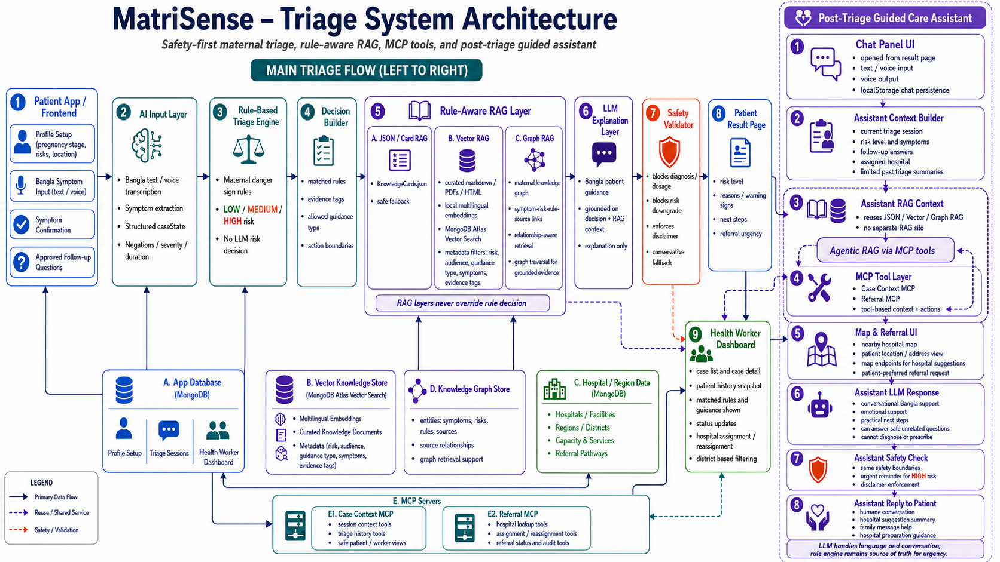
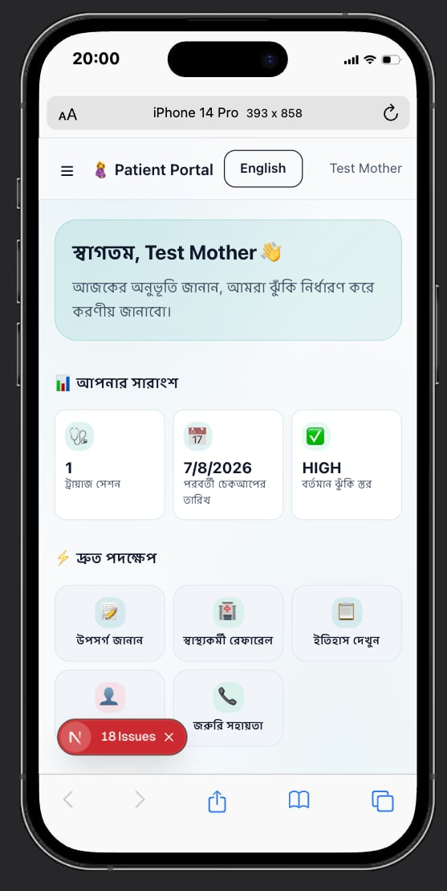
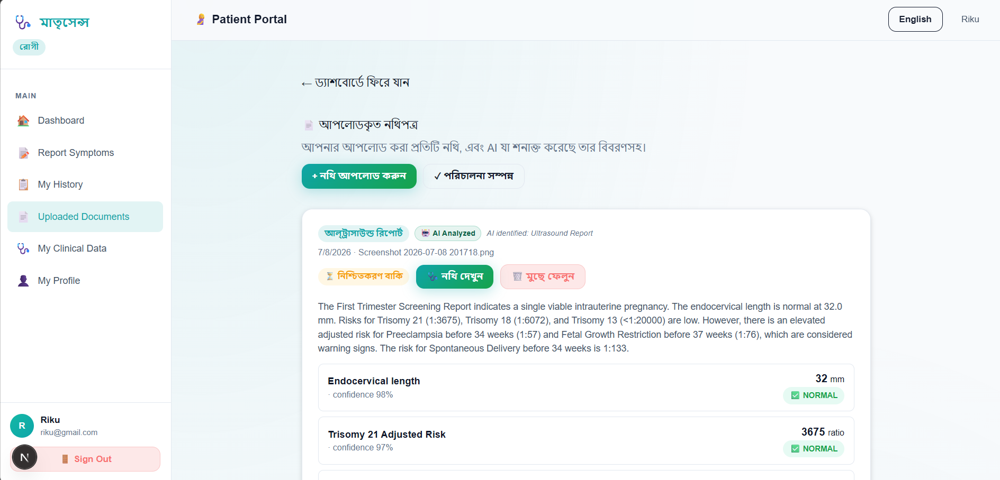
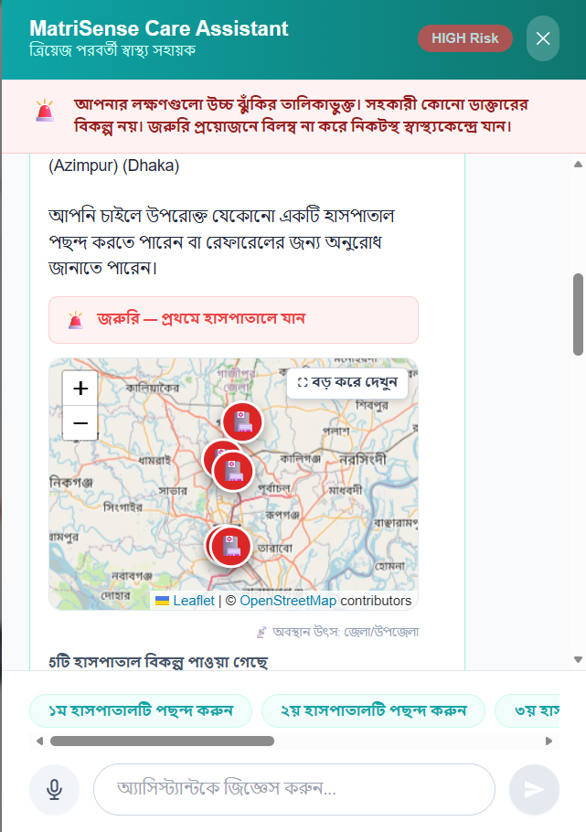
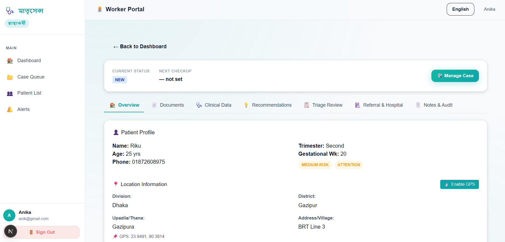
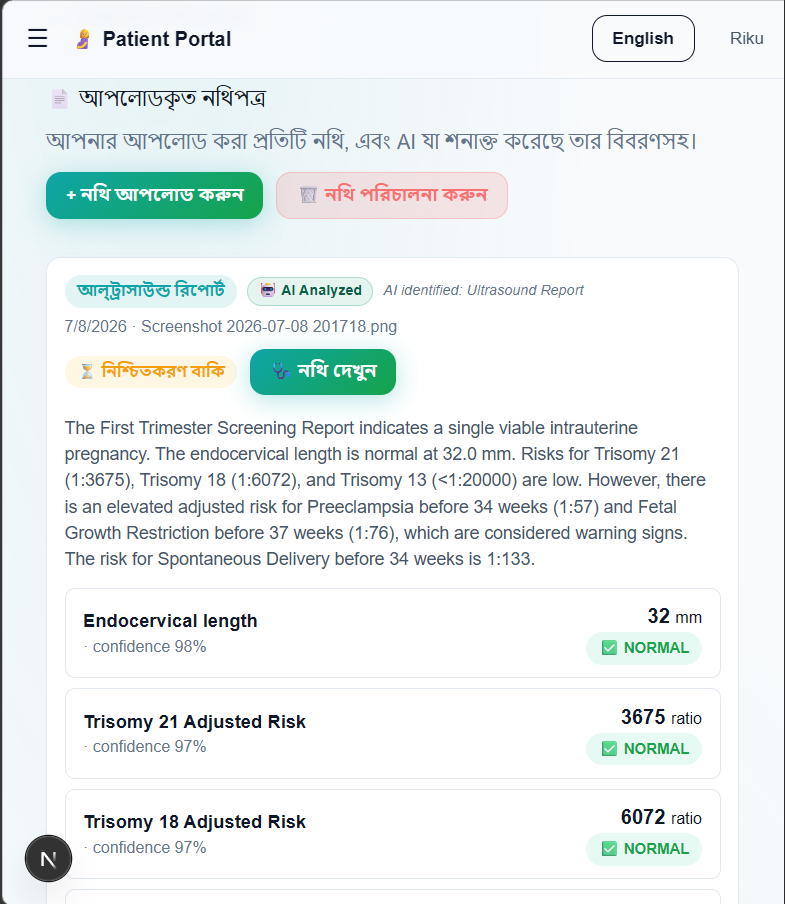
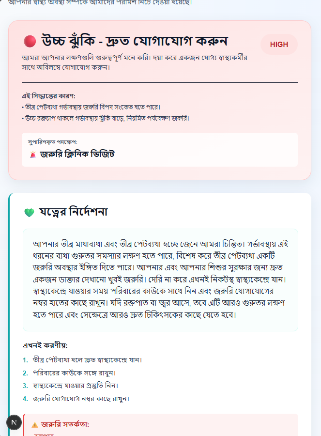

# MatriSense: AI-Native Bangla Maternal Triage & Health Referral System

**SciBlitz AI Challenge 2026**  
*Track A (Health & Society)*  
**Team:** IUT_Epoch22  

---

## 🚀 Important Links
- **Live Frontend Portal**: [https://matri-sense.vercel.app/](https://matri-sense.vercel.app/)
- **Backend API Server**: [http://matrisense-production.up.railway.app](http://matrisense-production.up.railway.app)
- **Backend API Health Check**: [http://matrisense-production.up.railway.app/api/health](http://matrisense-production.up.railway.app/api/health)
- **Demo Video**: [Link to Demo Video]() *(Placeholder)*
- **System Architecture Diagram**: [docs/report/ai_architecture_final_2_clear.png](docs/report/ai_architecture_final_2_clear.png)
- **Full Technical Report**: [docs/report/project_report.html](docs/report/project_report.html)

---

## 1. Problem Summary
Pregnant mothers in remote, rural areas of Bangladesh face unique barriers that delay recognition of emergency symptoms and increase maternal mortality rates:
1. **Lack of Healthcare Autonomy:** Women often cannot make independent decisions or spend family funds on healthcare without male family members' consent, leading to critical delays.
2. **Symptom Confusion & Costly Travel:** Poor families spend valuable money on long journeys to clinics for minor, non-emergency issues, while delaying help for high-risk symptoms because they cannot determine urgency.
3. **Social Taboos & Stigma:** Cultural stigmas lead to massive underreporting of symptoms. Mothers arrive at clinics with zero past history ("blank-slate" visits).
4. **Unstructured Paper Records:** Vital readings exist only on scattered paper prescriptions, handwritten blood pressure cards, and lab sheets, making historical trend analysis impossible.
5. **AI Safety Risks:** Standard medical AI chatbots frequently hallucinate, outputting unsafe drug dosages or downplaying critical warning signs (like recommending rest for preeclampsia symptoms).

---

## 2. Solution Overview
MatriSense solves these bottlenecks by wrapping generative AI inside deterministic, code-level safety boundaries:
1. **Bangla Voice Intake:** Mothers describe symptoms in informal Bangla. Groq Whisper transcribes it, and Gemini extracts clinical facts.
2. **Multimodal Document Reader:** Gemini Vision OCR parses handwritten blood pressure cards, prescriptions, and lab reports, extracting parameters (BP, hemoglobin, blood sugar) to build longitudinal records.
3. **Deterministic Rules Engine:** A local rules engine (`json-rules-engine`) categorizes triage risk (LOW, MEDIUM, HIGH) based on clinical thresholds. **AI is strictly blocked from making risk determinations.**
4. **Rule-Aware RAG:** Evidence-backed care guidance is retrieved from a MongoDB Atlas vector database (populated with WHO/DGHS guidelines). High-risk cases are restricted from receiving home-care advice.
5. **Worker Console:** Verified community health workers manage cases through a structured, consent-gated dashboard, assigning patients to Upazila hospitals.

---

## 3. System Architecture & Safety Design
MatriSense enforces a strict separation of concerns between linguistic extraction (AI models) and clinical decision logic (local code).



*   **Generative Layer:** Restrained to translation, transcription, OCR, and conversational explanations.
*   **Validation Layer:** Re-evaluates all extracted values against local code-level thresholds. If an LLM attempts to output a diagnosis, drug dosage, or home-care advice for high-risk cases, the **Post-Process Safety Validator** intercepts it and injects a pre-approved template.
*   **MCP Integration:** Two custom Model Context Protocol (MCP) servers standardized tools for patient case context and hospital referral lookups.

---

## 4. Challenge Requirement Coverage

| Track Requirement | MatriSense Implementation Details |
| :--- | :--- |
| **Multimodal Document OCR** | Gemini 2.5 Flash Vision extracts metrics from handwritten cards & printed reports |
| **Speech Intake Pipeline** | Groq Whisper `whisper-large-v3` API translates Bangla speech to editable text |
| **Deterministic Risk Engine** | Local `json-rules-engine` runs on backend; no AI computes risk ratings |
| **Localized Guidelines RAG** | MongoDB Atlas Vector Search + `Xenova/multilingual-e5-small` embeddings |
| **Triage Dashboards** | Next.js 15.5 React portals for patients (mobile) and health workers (tabbed desktop) |
| **External Interoperability** | Two custom Node.js Model Context Protocol (MCP) servers |
| **Privacy & Consent Gates** | Health worker access is locked unless patient toggles `shareConsent` to true |

---

## 5. Exact Vital Thresholds & Safety Rules
Even if the AI model parses a value as "Normal", the backend forces an override check against these clinical thresholds:

| Parameter | Normal Range | Warning Range | Critical Range (Flags Triage Alert) |
| :--- | :--- | :--- | :--- |
| **Systolic BP** | < 120 mmHg | 120 - 139 mmHg | ≥ 140 mmHg |
| **Diastolic BP** | < 80 mmHg | 80 - 89 mmHg | ≥ 90 mmHg |
| **Hemoglobin** | ≥ 11 g/dL | 9.0 - 10.9 g/dL | < 9.0 g/dL |
| **Blood Sugar** | < 95 mg/dL | 95 - 125 mg/dL | ≥ 126 mg/dL |
| **Urine Protein** | Negative | Trace / 1+ | ≥ 2+ |

---

## 6. Key Features & Visual Previews

### Patient Portal (Mobile-Optimized)
*   **Bangla Voice Triage:** Translates colloquial voice inputs to structured symtoms.
*   **AI-Assisted Document Upload:** Extracts vital signs from uploaded images of clinical papers.
*   **Discuss & Confirm Chat:** Interactive conversational assistant explaining OCR metrics with correction loops.

| Patient Dashboard | AI-Assisted Document Upload |
| :---: | :---: |
|  |  |

| Guided Care Assistant Review Chat |
| :---: |
|  |

---

### Frontline Health Worker Console
*   **Structured Cases:** Triage list prioritizing HIGH risk pregnant mothers.
*   **Tabbed Dossier Console:** 7-tab console (*Overview, Triage Review, Documents, Clinical Data, Recommendations, Referral & Hospital, Notes & Audit*).
*   **Facility Routing:** Search and match district and Upazila hospitals based on emergency capabilities.

| Health Worker Dashboard Overview |
| :---: |
|  |

---

### Evaluation Trend Metrics
*   **My Clinical Data:** Dynamic charts plotting historical blood pressure, hemoglobin, and blood sugar trends.
*   **Triage Risk Log:** Color-coded timeline displaying risk ratings.

| Vital Trend Charts (My Clinical Data) | AI-Guided Triage Results & Risk Rating |
| :---: | :---: |
|  |  |

---

## 7. Project Structure
```text
MatriSense/
├── backend/                  # Node.js + Express API server, local rules engine
│   ├── src/
│   │   ├── controllers/      # Triage, Document OCR, Auth, Hospital controller logic
│   │   ├── models/           # Mongoose schemas (Case, Patient, ClinicalDataPoint)
│   │   ├── rag/              # Vector RAG retrieval query pipelines
│   │   ├── routes/           # REST endpoints
│   │   ├── safety/           # Post-process safety regex validators
│   │   └── services/         # Gemini Vision parser, Groq Whisper transcription
├── frontend/                 # Next.js 15.5 Patient & Health Worker portals
│   ├── src/
│   │   ├── app/              # Next.js App Router pages
│   │   └── components/       # Core UI (vitals tracker, chat console, referral forms)
├── matrisense-referral-mcp/  # Custom Model Context Protocol (MCP) server
├── docs/                     # Documentation and static report assets
│   └── report/               # 8-page print-ready HTML & Markdown report files
└── README.md
```

---

## 8. Local Setup & Installation

### Prerequisites
*   Node.js (v18+)
*   MongoDB Instance (Local or Atlas URL)
*   Gemini API Key
*   Groq API Key

### 1. Backend Server Setup
```bash
cd backend
npm install
npm run dev
```
*Backend runs locally at: `http://localhost:5000`*

### 2. Frontend Portal Setup
```bash
cd frontend
npm install
npm run dev
```
*Frontend runs locally at: `http://localhost:3000`*

### 3. MCP Server Setup
```bash
cd matrisense-referral-mcp
npm install
npm start
```

---

## 9. Backend API Route Reference
All API endpoints are prefixed with `/api`:

| Method | Endpoint | Description |
| :--- | :--- | :--- |
| **POST** | `/api/auth/register` | Register new user (MOTHER or HEALTH_WORKER) |
| **POST** | `/api/auth/login` | Authenticate user and sign JWT |
| **POST** | `/api/speech/transcribe` | Transcribe audio files using Groq Whisper |
| **POST** | `/api/documents/upload` | Upload document file for Gemini Vision OCR parsing |
| **POST** | `/api/documents/chat` | Chat with document-scoped review assistant |
| **POST** | `/api/documents/confirm` | Save extracted clinical values to profile database |
| **POST** | `/api/triage/submit` | Evaluate symptoms against local rule engine and save triage |
| **GET** | `/api/triage/cases` | Fetch all triage cases (Health Worker role required) |
| **GET** | `/api/patient/history/:id` | Retrieve patient longitudinal vital stats (BP, sugar, Hb) |
| **POST** | `/api/referral/assign` | Refer patient to designated hospital |

---

## 10. Model Context Protocol (MCP) Tools
The custom MCP server exposes standard JSON tools for clinical agents:

### `matrisense-case-context-mcp`
*   `get_case_details(patientId)`: Returns pregnancy week, active symptoms, and historical risk level.
*   `fetch_vital_history(patientId)`: Retrieves longitudinal blood pressure, blood sugar, and hemoglobin data.

### `matrisense-referral-mcp`
*   `search_hospitals(district, minimumCapabilities)`: Queries hospitals matching services like NICU, emergency delivery, or blood banks.
*   `calculate_hospital_distance(patientCoords, hospitalCoords)`: Computes geographic distance to recommend the closest capable facility.

---

## 11. Environment Configuration

### Backend (`backend/.env`)
```env
PORT=5000
MONGO_URI=mongodb+srv://<username>:<password>@cluster0.mongodb.net/matrisense
JWT_SECRET=your_jwt_signing_key_here
GEMINI_API_KEY=your_gemini_api_key_here
GROQ_API_KEY=your_groq_api_key_here
```

### Frontend (`frontend/.env.local`)
```env
NEXT_PUBLIC_API_URL=http://localhost:5000
```

### Referral MCP Server (`matrisense-referral-mcp/.env`)
```env
MONGO_URI=mongodb+srv://<username>:<password>@cluster0.mongodb.net/matrisense
PORT=8080
```

---

## 12. Deployment Instructions

### Deploying Backend (Railway)
1.  Initialize a new service on **Railway** linking your GitHub repository.
2.  Set the Root Directory to `/backend`.
3.  Set Build Command to `npm install` and Start Command to `npm run start`.
4.  Configure all variables in the Railway console (`MONGO_URI`, `JWT_SECRET`, `GEMINI_API_KEY`, `GROQ_API_KEY`).

### Deploying Frontend (Vercel)
1.  Add a new project on **Vercel** linking the repository.
2.  Set the Root Directory to `/frontend`.
3.  Add the environment variable `NEXT_PUBLIC_API_URL` pointing to your deployed Railway API URL.
4.  Click **Deploy**.

---

## 13. Future Roadmap & Scaling
*   📶 **Offline-First PWA:** Cache symptoms and profile state locally on patient devices. Execute local JavaScript rules offline and queue document uploads for synchronization when connectivity returns.
*   🦙 **Edge LLMs (Ollama):** Host fine-tuned models (e.g. Qwen-1.5B, LLaMA-3B) at Upazila community clinics for local OCR extraction and translation without public internet.
*   💬 **SMS Outreach Channels:** Integrate Twilio or local GSM modems to send automated SMS notifications to health workers when high-risk cases are logged.
*   🕸️ **GraphRAG Extensions:** Build knowledge graphs linking symptoms, national obstetric guidelines, and hospital facilities for advanced semantic routing and context-aware referral checks.
