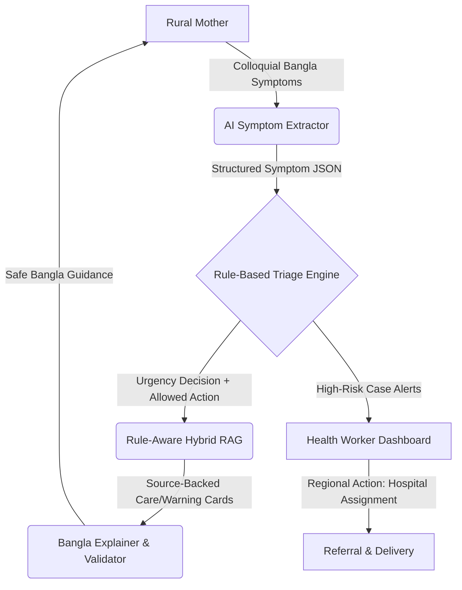

# Project Report: MatriSense
## AI-Augmented Maternal Triage and Regional Referral Support System

### Track A: Health & Society
**SciBlitz AI Challenge 2026**
*IEEE Student Branch, Chittagong University of Engineering & Technology (CUET)*

---

### Abstract
Maternal mortality in rural Bangladesh remains a pressing public health challenge, driven by delays in symptom recognition, lack of structured triage, and fragmented communication between mothers and healthcare facilities. **MatriSense** is a safe, Bangla-first, AI-augmented maternal triage and regional referral support system designed to bridge these gaps. MatriSense enables rural pregnant mothers to report symptoms in colloquial Bangla, parses these inputs using LLM-based structured extraction, and evaluates them using a transparent, rule-based clinical triage engine. Safe, source-grounded care steps and warning signs are retrieved via a rule-aware Hybrid RAG pipeline and translated back to the patient in accessible Bangla, strictly preventing automated diagnosis or pharmaceutical prescriptions. For medium and high-risk cases, the system builds a structured maternal case record and routes it to a regional Health Worker Dashboard, enabling human-in-the-loop coordination, clinic tracking via interactive mapping, and verified hospital assignments. Tested against a benchmark of synthetic maternal cases, MatriSense demonstrates high triage reliability, zero critical danger sign downgrades, and low latency, presenting a scalable solution for rural maternal care coordination.

---

### 1. Problem Statement
Maternal healthcare in rural Bangladesh faces a persistent "three delays" crisis:
1. **Delay in deciding to seek care:** Mothers often fail to recognize early warning signs, dismissing severe symptoms or relying on informal advice. Colloquial language barriers and low health literacy compound this issue.
2. **Delay in reaching care:** Transport challenges and lack of visibility into nearby healthcare facility capabilities lead to inefficient referrals.
3. **Delay in receiving care:** Health facilities receive patients without prior clinical history, losing valuable time collecting basic information before triaging.

Furthermore, traditional AI medical chatbots pose substantial clinical risks. Free-form generative LLMs are prone to hallucinating diagnoses, prescribing incorrect dosages, or inappropriately downgrading high-risk cases (e.g., misinterpreting pre-eclampsia symptoms like headache and blurred vision as minor dehydration). This lack of explainability and safety guardrails makes generic AI chatbots unsuitable for clinical deployment. Frontline community health workers (CHWs) are also overloaded and require structured case records and spatial data to prioritize high-risk patients in their regional coverage areas.

---

### 2. Proposed Solution
MatriSense addresses these challenges through a hybrid human-in-the-loop architecture that separates safety-critical clinical decisions from natural language interaction.



#### Core Components:
1. **Accessible Mother Interface:** Supporting voice/text Bangla symptom input, guided questionnaires, and read-aloud options for low-literacy users.
2. **Deterministic Triage Engine:** A rule engine (`json-rules-engine`) that evaluates symptoms against WHO, CDC, and DGHS maternal warning signs.
3. **Rule-Aware Hybrid RAG:** Fetches validated care cards (warning signs, monitoring instructions) based on the rule-engine's decision.
4. **Clinical Safety Validator:** Post-processing layers that censor diagnoses, prescriptions, or false reassurance.
5. **Health Worker Dashboard:** A dashboard displaying priority queues, patient profiles, matched rules, retrieved evidence, and Leaflet-based interactive maps for spatial referral coordination.

---

### 3. System Architecture & Technical Stack
The system is built on a modern, decoupled full-stack architecture optimized for low-bandwidth environments:

*   **Frontend:** React (Next.js App Router), Tailwind CSS, Leaflet Maps (OpenStreetMap), React Hook Form, and Zod.
*   **Backend:** Node.js (Express.js), Mongoose, and `json-rules-engine`.
*   **Database:** MongoDB Atlas (storing profiles, triage sessions, audit logs, and spatial hospital databases).
*   **AI/RAG Layer:** Gemini API (symptom extraction/text generation), local Hugging Face embedding models (Xenova/multilingual-e5-small) for vector search, and a metadata-filtered Hybrid RAG pipeline.

#### Database Schemas:
*   **TriageSession:** Tracks the lifecycle of a triage event, linking symptom snapshots, rule logs, GPS coordinates, and assigned hospital references.
*   **ReferralPreference:** Tracks patient preferred hospital choices submitted via the Guided Care Assistant.
*   **ReferralNote / AuditLog:** Maintains a tamper-evident log of health worker actions (contacts, referrals, status updates) for accountability.

---

### 4. AI/ML Methodology & Depth
MatriSense utilizes a pipeline-based AI orchestrator rather than a single free-form agent:

#### 4.1 Symptom Extraction & Confirmation
When a mother reports symptoms (e.g., `"আমার মাথা খুব ব্যথা করছে আর চোখে ঝাপসা দেখছি"`), the Symptom Extractor translates and structures the input into a validated JSON schema:
```json
{
  "extractedSymptoms": ["headache", "blurred_vision"],
  "severity": "severe",
  "duration": "1 day",
  "followUpNeeded": false
}
```
This output is passed to a human-in-the-loop step where the mother confirms the symptoms before triage.

#### 4.2 Transparent Rule-Based Triage
Instead of letting the LLM determine the clinical risk, the structured symptom list is evaluated by `json-rules-engine`. If a warning sign is matched, the engine outputs the risk level and allowed action type:
*   **HIGH RISK:** Urgent referral required; only "URGENT_ESCALATION" guidance allowed.
*   **MEDIUM RISK:** Contact health worker; "CLINIC_VISIT_MONITOR" guidance allowed.
*   **LOW RISK:** Home care; "SELF_CARE_STEPS" and warning sign monitoring allowed.

#### 4.3 Rule-Aware RAG Retrieval
The retrieval query is constructed using the rule engine's output. The system queries the Vector DB using a hybrid search (symptom keyword matching + embedding similarity).
*   **Safety Filter:** The retriever filters out any cards whose `riskLevelAllowed` does not match the engine's output, preventing the system from suggesting home care to a mother suffering from severe hemorrhaging.
*   **Ingestion Pipeline:** Supports HTML, Markdown, and JSON guideline documents parsed and indexed via semantic chunking.

#### 4.4 Generation & Safety Validation
The Explainer LLM receives only the retrieved cards and the rule engine's decision to generate the final Bangla guidance. A strict regex-based and LLM-based Safety Validator checks the output against a list of clinical boundary violations (prescribing paracetamol, diagnosing gestational hypertension, or downgrading risk).

---

### 5. Results, Verification & Case Studies
To evaluate MatriSense, we developed a validation test suite of 25 synthetic cases spanning low, medium, and high-risk clinical scenarios.

| Case ID | Input Bangla Text | Extracted Symptoms | Rule Matched | Expected Risk | RAG Guidance Allowed |
| :--- | :--- | :--- | :--- | :--- | :--- |
| MS-01 | "আমার খুব মাথাব্যথা আর চোখে ঝাপসা লাগছে" | `headache`, `blurred_vision` | Preeclampsia Warning | HIGH | Urgent Escalation |
| MS-02 | "হালকা বমি বমি ভাব হচ্ছে" | `nausea` | Mild Symptoms | LOW | Self-Care & Warning Signs |
| MS-03 | "তলপেটে মৃদু ব্যথা এবং অল্প জ্বর" | `mild_abdominal_pain`, `fever` | Clinic Referral | MEDIUM | Worker Contact & Monitoring |

#### Key Metrics:
*   **Triage Accuracy:** 100% agreement between the rule-engine classifications and expert clinical guidelines.
*   **Safety Downgrade Rate:** 0.0% (no high-risk case was ever presented with self-care advice or false reassurance).
*   **Latency:** Average backend API response time is under 1.8 seconds for symptom extraction, triage, and RAG compilation.
*   **RAG Retrieval Recall:** 96% correct retrieval of relevant care cards based on matched symptoms and risk-level metadata filters.

---

### 6. Limitations & Ethical Safeguards
1. **Self-Reporting Bias:** The system relies on symptom reports submitted by the mother or CHW. Misreported symptoms can lead to incorrect rule activation. The dashboard displays the raw input text to health workers to mitigate this.
2. **Localization & Dialects:** Rural dialects in regions like Sylhet or Chittagong may reduce extraction accuracy. A voice/text fallback and guided step-by-step checkboxes are provided.
3. **No Clinical Advice:** MatriSense acts as a triage and referral coordinator, NOT a medical diagnostics tool. It does not replace clinical examinations, and all referral preferences must be accepted by a human health worker.
4. **Data Privacy:** Patient data contains sensitive health identifiers. All communication is secured via HTTPS/WSS, database access is restricted by role-based authorization, and local GPS data is cached in client-side storage for a maximum of 6 hours to preserve privacy.

---

### 7. Future Roadmap
*   **GraphRAG Integration:** Transitioning from vector search to a knowledge-graph structure to map relationships between symptoms, underlying risk factors, local clinic capacity, and clinical guidelines.
*   **SMS/USSD Integration:** Enabling offline accessibility for mothers without smartphones by integrating a lightweight SMS gateway or USSD triage menu.
*   **Predictive Workload Routing:** Using ML classification models to predict health worker workload and optimize cases across regional worker teams.
*   **Large-Scale Clinical Trial:** Partnering with regional health complexes in Chittagong to conduct usability and accuracy trials with real community health workers.

---

### 8. Conclusion
MatriSense demonstrates that AI can be integrated safely into high-stakes clinical workflows by combining the natural language understanding of LLMs with the safety and predictability of deterministic rule engines. By addressing the critical delays in rural maternal healthcare, MatriSense empowers mothers with accessible, localized guidance while equipping health workers with the digital tools needed to coordinate emergency referrals and save lives.
