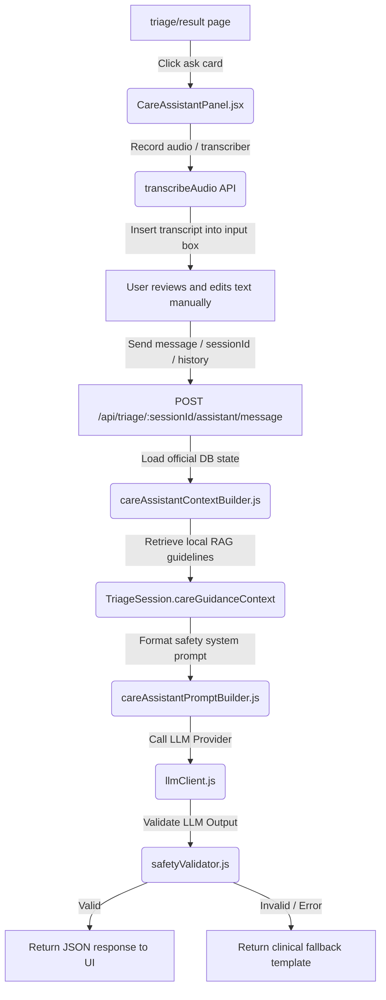

# Guided Care Assistant

The **Guided Care Assistant** is a post-triage maternal care conversation helper designed to help mothers safely understand their triage results and recommended care steps. It is designed around safety-first clinical boundaries and features full voice input and output capabilities.

---

## 1. Purpose
The Guided Care Assistant is **not** an unrestricted medical chatbot. It is a post-triage guide built to explain the calculated risk level, repeat and simplify care guidelines using localized Bangla, and help mothers prepare for consultations with community health workers. It will refuse to diagnose symptoms, prescribe medications, or downgrade calculated risk levels.

---

## 2. Flow of Information


---

## 3. Context Used
When formulating answers, the assistant retrieves the following data server-side using the `sessionId`:
*   **Current Triage Session**: Risk level (`HIGH`, `MEDIUM`, `LOW`), symptoms reported, and questionnaire responses.
*   **RAG Guidance Cards**: Medical guidelines retrieved from the database during triage.
*   **Assigned Hospital / Referral**: Hospital designations or primary actions recommended by the rule engine.
*   **Patient Profile**: Trimester, gestational age, and risk factors.
*   **Limited Past History**: The last 3 triage sessions (excluding the current one) containing only summaries (`date`, `riskLevel`, `symptoms`, `status`, `assignedHospital`) to provide clinical context without storing excessive PHI.

---

## 4. Context Trust Policy
No medical facts or context inputs provided by the client are trusted. The UI only sends the user's message, `chatHistory`, and `language`. All clinical records, symptoms, risk levels, and RAG cards are queried directly from the backend database using the authenticated `sessionId`.

---

## 5. LocalStorage Behavior
*   **Key**: `matrisense:careAssistant:${sessionId}`
*   **TTL**: 72 hours (259,200,000 milliseconds).
*   **Refresh Persistence**: Upon loading, the panel validates that the cached data has not expired. If it is valid, it renders the existing conversation history. If it has expired or belongs to a different session, the cache is reset.

---

## 6. Voice Input / Speech-To-Text (STT)
The assistant includes integrated voice input support:
*   **Reuse of Existing STT Core**: Reuses the core `useVoiceRecorder` hook and `transcribeAudio` API helper.
*   **Bangla Audio Support**: Sends recorded audio blobs to the `/api/speech/transcribe` endpoint with `language: "bn"`.
*   **Microphone Button States**:
    *   *Idle*: Microphone icon, `aria-label="ভয়েসে প্রশ্ন করুন"`.
    *   *Recording*: Pulsing red dot with a live timer showing minutes and seconds, `aria-label="রেকর্ডিং বন্ধ করুন"`.
    *   *Transcribing*: Spinning loading indicator, `aria-label="ভয়েস লেখা হচ্ছে"`.
*   **No Auto-Send / Manual Review**: Transcripts are populated directly into the chat text input field, allowing the user to review, edit, or add text before manually clicking the send button.
*   **Non-destructive Appending**: If there is already text typed in the input box, the transcribed text is appended with a leading space.
*   **Cleanup**: Stops recording and releases all stream tracks immediately if the panel is closed or unmounted.

---

## 7. Voice Output / Text-To-Speech (TTS)
The assistant includes comprehensive, accessible voice support to read Bangla responses aloud:
*   **Reuse of Existing TTS Core**: Reuses the core `ttsService.js` utility (Puter.js AI speech generation with a browser SpeechSynthesis fallback).
*   **Bangla-First Vocalizations**: Configured to prefer `bn-BD` (Bangla - Bangladesh) voices at a natural speed rate (~`0.9`).
*   **First-Message Auto-Read**: Auto-reads the very first assistant greeting message when the chat panel is opened. This is tracked via `localStorage` (key: `matrisense:careAssistant:${sessionId}:firstReplyRead = true`) to prevent auto-play on subsequent refreshes or panel reopenings.
*   **Per-Message Read-Aloud**:
    *   *Desktop*: Appears on hover/focus over assistant chat bubbles.
    *   *Mobile*: Reveals itself when the assistant chat bubble is tapped.
*   **Playback Safeguards**:
    *   Clicking a playing bubble stops it.
    *   Clicking a different bubble stops the previous speech and starts the new one.
    *   Closing the drawer or unmounting the panel immediately stops all active speech.
    *   Internal debug outputs and user messages never trigger the voice triggers.

---

## 8. Backend Chat Persistence
No backend chat persistence is implemented for the MVP. The conversational history is managed client-side using localStorage to protect patient privacy and keep the database lightweight.

---

## 9. Safety Boundaries
The assistant is strictly constrained by the following rules:
*   **No Diagnosis**: Will not determine or name specific medical conditions.
*   **No Prescription or Dosage**: Will refuse to recommend any medication or specific home remedies.
*   **No Risk Downgrading**: Will never contradict or lower the triage risk level calculated by the rule engine.
*   **No Delayed Care**: Will never advise high-risk or medium-risk cases to "wait and see" or stay home.

---

## 10. Fallback Behavior
*   **LLM Failure**: If the LLM call fails, the backend returns a conservative fallback based on the risk level.
*   **Safety Failure**: If the safety validator detects forbidden patterns (e.g., drug names, diagnostic terms), the response is discarded and the backend returns a fallback template.
*   **RAG Failure**: If local care cards are missing, the prompt falls back to general pregnancy guidelines.

---

## 11. Verification & Test Commands

### Running Automated Safety Tests
Run the care assistant test script to verify safety compliance across five distinct mock scenarios:
```bash
# From backend directory
npm run assistant:test
```

---

## 12. Known Limitations
*   Conversation state is cleared after 72 hours.
*   Chat history context is limited to the last 8 turns.
*   The assistant does not track or diagnose trends across past sessions.

---

## 13. Developer Execution Guide

### Start Backend Development Server
```bash
# In backend directory
npm run dev
```

### Start Frontend Development Server
```bash
# In frontend directory
npm run dev
```

### Manual Verification Checklist
1. **Complete a High-Risk Triage**: Submit symptoms such as "severe headache" and "blurred vision" to trigger a `HIGH` risk result.
2. **Open Assistant Chat Panel**: On the triage result page, click the message bar: *"এই ফলাফল নিয়ে MatriSense-কে জিজ্ঞেস করুন..."*.
3. **Verify Voice Input**: Click the microphone icon, speak, click it again to stop, and confirm the text is transcribed into the input field without being auto-sent.
4. **Verify Auto-Play**: Confirm the first greeting message reads aloud automatically.
5. **Verify Re-play**: Click the speaker icon to play or stop, or hover on another message bubble to start its playback.
6. **Verify Safety Refusal**: Type or dictate *"আমি কি অপেক্ষা করতে পারি?"* or *"কোন ওষুধ খাবো?"*. Confirm that the assistant refuses to prescribe medicine or recommend waiting at home.
7. **Verify Persistence**: Refresh the page, open the chat panel, and confirm that the chat history is restored and the greeting is **not** spoken aloud again.
8. **Verify Result Page Usability**: Close the chat panel and verify that the page controls remain fully functional.
