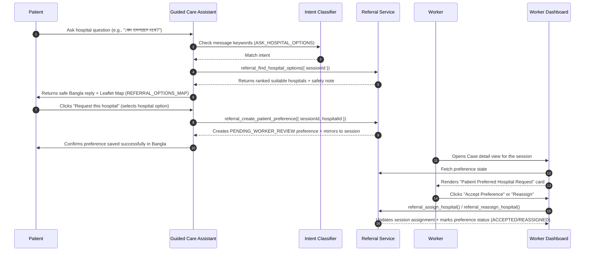

# Patient-Preferred Referral Workflow & Safety Spec

This document details the patient-preferred referral preference request flow, safety boundaries, future Model Context Protocol (MCP) server wrapper plan, health-worker confirmation rule, and mapping configurations for MatriSense.

---

## 1. Patient-Preferred Referral Request Flow

The sequence starts when a patient interacts with the Guided Care Assistant and inquires about suitable hospitals:

---

## 2. Safety Boundaries

To protect patient safety and prevent autonomous misrouting during high-risk obstetric scenarios:

*   **No Real-time Capacity Claims:** The hospital list lists capability and proximity, but explicitly states it does not guarantee real-time bed or staff availability.
*   **No Autonomous Assignment:** Patients *request* a preference; only a qualified human health worker or admin can *assign* and finalize the referral.
*   **Risk-Level Priority & Escalation:**
    *   **HIGH Risk Cases:** The system prioritizes immediate urgent clinical instructions ("Go to the hospital immediately") first. Comparison or delay-inducing wording is suppressed. The map shows emergency-capable facilities first.
    *   **MEDIUM Risk Cases:** Standard supportive suggestions are allowed, but the assistant explicitly guides them to consult their health worker.
*   **Privacy & Location Consent:** Live GPS coordinates are only queried if the patient's `consentToUseLocationForReferral` flag is set to `true`. Otherwise, the system falls back to text-based profile parameters (district and upazila) or prompts them for consent.

---

## 3. Future MCP Wrapper Plan

The backend functions are implemented in the service layer using snake_case and decoupled from the Express request lifecycle. This enables the future `matrisense-referral-mcp` server to wrap them directly as MCP tools:

| MCP Tool Name | Wrapped Service Function | Description |
|---|---|---|
| `referral_find_hospital_options` | `referral_find_hospital_options(input)` | Lists matching hospitals based on location, services, and risk. |
| `referral_get_hospital_details` | `referral_get_hospital_details(input)` | Retrieves detailed metadata for a single active facility. |
| `referral_get_referral_status` | `referral_get_referral_status(input)` | Retrieves assignment and pending preference status. |
| `referral_get_assigned_hospital` | `referral_get_assigned_hospital(input)` | Retrieves the confirmed worker assignment snapshot. |
| `referral_create_patient_preference` | `referral_create_patient_preference(input)` | Creates a pending hospital preference for a session. |
| `referral_assign_hospital` | `referral_assign_hospital(input)` | Finalizes a hospital assignment (called by workers). |
| `referral_reassign_hospital` | `referral_reassign_hospital(input)` | Reassigns to a different hospital and flags history (called by workers). |

---

## 4. Health-Worker Confirmation Rule

A patient's preferred hospital remains in `PENDING_WORKER_REVIEW` until a worker explicitly acts on it.
*   If the worker selects the patient's preferred hospital, the status transitions to `ACCEPTED`.
*   If the worker chooses another hospital, the status transitions to `REASSIGNED`.
*   If the worker rejects the preference with a note, the status transitions to `REJECTED`.

This rule guarantees that clinical validation always overrides patient choice, preventing unsafe self-referrals (e.g., choosing a basic clinic for a severe preeclampsia crisis).

---

## 5. Map and Data Source Notes

*   **Leaflet & OpenStreetMap:** The front-end renders interactive maps using Leaflet tiles served by OpenStreetMap, preserving proper attributes.
*   **SSR Safety:** Map components use Next.js dynamic imports with `ssr: false` to prevent window/document undefined issues during pre-rendering.
*   **Demo Seed Data:** In local demo environments, `Farazi Hospital` in Banasree is positioned at a hardcoded 2.45 km distance from the simulated patient coordinates to ensure predictable testing behaviors.
